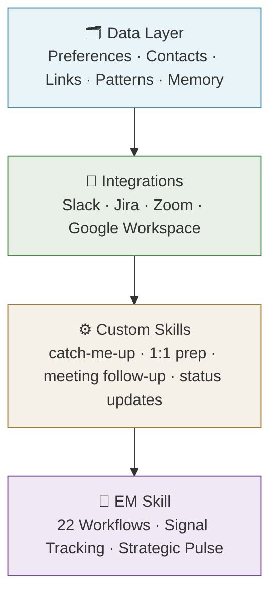

# The Solution: A Layered Architecture

*[← Home](../README.md) | [Next →](./01-data-layer.md)*

---

The five philosophy essays named the problems. This is the system built to solve them.

Not a single tool. A stack where every design decision traces back to one of the arguments made in the philosophy section. Understanding why the layers exist in this order matters as much as understanding what they do.

---

## The Stack

Each layer enables the next.

Build integrations without a data layer and the signals they return have no interpretation layer. The AI can pull a conversation or an activity log, but without knowing who the people are, what the team structure looks like, or what my role expectations are, it can only report what it sees. It can't tell me what matters.

Build custom skills without integrations and I have a prompt template, not a skill. A 1:1 prep routine that can't reach back into meeting summaries, recent project activity, and team conversations is just a list of questions asking me to fill in what the system should already know. The skill's value is synthesis, and synthesis requires access to the source material.

Build the EM skill without the layers beneath it and I'm back to self-report. The strategic pulse asks hard questions, but without integrations feeding it real signals and a data layer calibrating what those signals mean in my specific context, the answers come from me, not from evidence. That's not objectivity. That's a structured conversation with myself.

---

## Layer 1: The Data Layer

The data layer is a set of persistent files that give the AI lasting knowledge of my world: who I work with, how I work, what tools I use, what matters to me. It loads automatically at the start of every session, before I say a word. Each file covers a different dimension of that context, and together they ensure the AI arrives calibrated rather than blank.

This layer exists because of what [The Context Problem](../philosophy/04-the-context-problem.md) established: EM work is a context-maintenance problem, and the context that makes AI useful for a role like this lives inside my head, not in a codebase or a database. Without a persistent layer to hold it, every session starts from zero. The overhead of re-explanation never drops. Built once and maintained through use, the context tax drops close to zero. Everything above this layer depends on it.

→ [Read more: The Data Layer](./01-data-layer.md)

---

## Layer 2: Integrations

The integrations layer connects the tools already in use: the communication platforms, project trackers, meeting systems, and document infrastructure that EM work already runs through. The goal isn't a collection of separate connections. It's a unified interface, so a question like "what happened while I was out?" pulls from all of them at once, synthesized rather than stacked.

[Finally, the Data](../philosophy/03-finally-the-data.md) named the leap forward that makes this layer meaningful: AI can take the signals that already exist in my day-to-day management work and cross-reference them against a standard of what good management looks like. But it can only do that if it has access to where those signals live. The signals are scattered across every tool in the stack. The integrations layer is what turns them into something a system can actually watch. It's the infrastructure that makes the watcher real.

→ [Read more: Integrations](./02-integrations.md)

---

## Layer 3: Custom Skills

Custom skills are repeating EM workflows encoded as reusable sequences: the patterns that show up in my week, done consistently and well without the overhead of doing them manually each time. Coming back from time away, preparing for a 1:1, following up after a meeting, keeping stakeholders current — each of these has a shape that repeats. Skills make that shape reliable.

This is Phase one from [The Efficiency Trap](../philosophy/05-the-efficiency-trap.md): taking the things already being done and doing them faster, more consistently, with less overhead. Custom skills deliver real value. Showing up to every 1:1 prepared, recovering from a week off in an hour, following through on things that would otherwise slip: these matter. But Phase one optimizes within the role. It doesn't evaluate the role. That required something different in kind.

→ [Read more: Custom Skills](./03-skills.md)

---

## Layer 4: The EM Skill

The EM skill is a strategic layer that maps the Engineering Manager role into a set of discrete workflows across People, Process, and Product. Each workflow has defined healthy states, gap signals, and criteria for getting back on track. The skill tracks signals from real work and surfaces observations against the expectations of the role, not self-report, not gut feel. A regular strategic pulse asks the harder questions: whether my time is going where it should, whether the right relationships are getting attention, whether I'm operating at the right altitude.

This is where the full arc of the philosophy section lands. [The EM Inflection Point](../philosophy/01-the-em-inflection-point.md) named why "use AI" hits differently when my job is people. [Objectivity as the Standard](../philosophy/02-objectivity-as-the-standard.md) established what management excellence has always required and why it's been so hard to achieve. [Finally, the Data](../philosophy/03-finally-the-data.md) described the possibility of continuous, unbiased signal-watching at a scale no previous tool could manage. And [The Efficiency Trap](../philosophy/05-the-efficiency-trap.md) named Phase two: not automation, but reflection. A system that doesn't help me move faster, but helps me ask whether I'm moving in the right direction. The EM skill is the answer to all of it.

→ [Read more: The EM Skill](./04-em-skill.md)

---

*[← Home](../README.md) | [The Data Layer →](./01-data-layer.md)*
