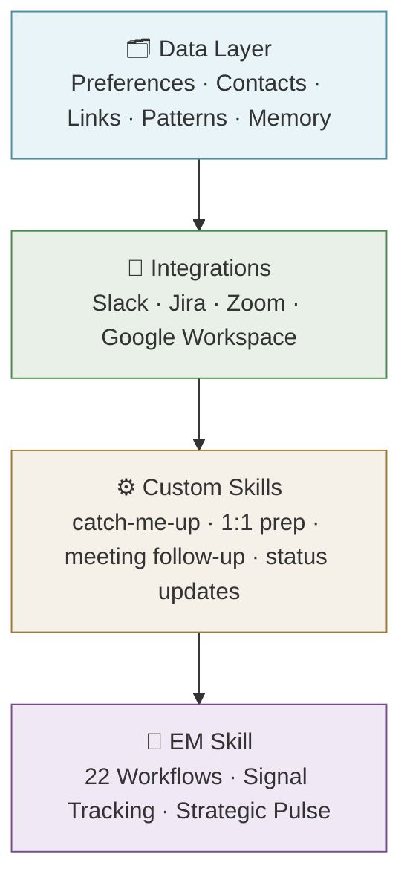

# The System: A Layered Architecture

*[← Home](../README.md)*

---

Before describing what I built, it helps to understand the problem it's solving.

An Engineering Manager holds a lot of context simultaneously: where each person is in their career, what the team shipped last week, what's blocked, what's drifting, what was said in the last 1:1, what wasn't. In a given day I might move from a performance conversation to a sprint review to a cross-functional sync to a hiring loop — each requiring a completely different mental model, loaded from scratch.

AI is good at holding context. But it forgets everything between sessions.

The gap between "AI is good at context" and "AI forgets between sessions" is what this system is designed to close. It's not a single tool — it's a stack, where each layer enables the one above it.

---

## The Stack

Each layer depends on the one below it. Skip a layer and the ones above get brittle.

---

## Layer 1: The Data Layer

**What it is:** A set of persistent files that give the AI lasting knowledge of your world — who you work with, how you work, what tools you use, what matters to you.

**Why it's foundational:** Without this layer, every session starts from zero. You re-explain your team, re-establish your preferences, re-describe the tools. It's the equivalent of re-introducing yourself to a colleague at the start of every conversation.

With a data layer in place, the AI loads your world before you say a word.

The data layer includes: a preferences file (your working style and communication expectations), a contacts file (your team with Slack handles, GitHub profiles, roles, and context), a links file (the tools and spaces you navigate repeatedly), a patterns file (how the tools behave and what the AI should know about using them), and a memory folder (things worth remembering across sessions).

An init skill pulls all of this together at the start of every session — a single loading step that makes everything else possible.

→ [Read more: The Data Layer](./01-data-layer.md)

---

## Layer 2: Integrations

**What it is:** Connections to the tools you already use — your communication platform, project tracker, meeting platform, and document system — unified behind a single conversational interface.

**Why it matters:** The EM role is multi-tool by nature. Staying current means context-switching constantly across platforms. Integrations collapse that into one place.

The result isn't magic — it's elimination. You stop switching. You stop copying context from one tool into another. You ask in plain language and get back synthesized information from all of them.

This layer required more work than the data layer. Each tool has its own authentication model, API quirks, and failure modes. Building reliable wrappers took iteration. But the investment compounds — every skill built above this layer benefits from it.

→ [Read more: Integrations](./02-integrations.md)

---

## Layer 3: Custom Skills

**What it is:** Repeating workflows that have been encoded as reusable skills — sequences of tool calls and synthesis steps that execute a specific task end-to-end.

**Why it matters:** Most of what an EM does is pattern-based. Coming back from vacation, you do the same re-orientation every time. Before every 1:1, you do the same preparation. After every meeting, you do the same follow-up. Encoding those patterns as skills means doing them consistently and doing them well, without the overhead of doing them manually.

The four core skills I built:

| Skill | What it solves |
|---|---|
| **catch-me-up** | Back from any absence — full situational awareness in one pass |
| **1:1 prep** | Walk into every 1:1 with recent context, not blind catch-up |
| **meeting follow-up** | Capture what was shared before the next meeting pulls you away |
| **status updates** | Consistent, well-written updates without the manual synthesis |

→ [Read more: Custom Skills](./03-skills.md)

---

## Layer 4: The EM Skill

**What it is:** A strategic layer that maps the EM role into 22 discrete workflows across People, Process, and Product — each with defined healthy states, gap signals, and recovery criteria. Includes a regular cadence of workflow assessments and a strategic pulse that runs every few weeks.

**Why it's different:** The first three layers make the job more efficient. This layer asks whether you're doing the right job at all.

It works by tracking signals from real work — meeting summaries, 1:1 notes, task completions, team activity — and surfacing observations against the expectations of the role. Not self-report. Not gut feel. Evidence, compared against external standards.

The pulse runs periodically and asks a harder set of questions: Where has your time actually gone? Who on your team hasn't had a meaningful conversation with you in too long? Are you operating at the right altitude, or have you been pulled tactical? Are the gaps accumulating, or are you catching them?

This is the layer I couldn't have predicted at the start. I built the data layer and integrations and skills because they were obvious improvements to efficiency. The EM skill emerged from a different question entirely.

→ [Read more: The EM Skill](./04-em-skill.md)

---

## Why the Layers Matter

It's tempting to skip to the interesting part — the strategic skill, the pulse, the workflow assessments. But the layers aren't just architecture. They're prerequisites.

A strategic pulse that can't access your meeting history isn't a pulse — it's a questionnaire. A 1:1 prep skill that doesn't know who your team is asks you to fill in the blanks. An integration that doesn't know your tool patterns breaks on edge cases.

The sequence matters: build context first, then connect tools, then encode patterns, then ask the harder questions. Each layer earns the one above it.

---

*[← Home](../README.md) · [The Data Layer →](./01-data-layer.md)*
